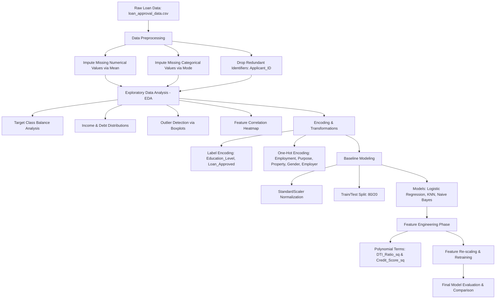

# 💳 CreditWise: Intelligent Loan Approval & Credit Risk Prediction System

[](https://www.python.org/)
[](https://jupyter.org/)
[](https://scikit-learn.org/)
[](https://pandas.pydata.org/)
[](LICENSE)

An end-to-end machine learning solution for automated retail loan eligibility evaluation and credit risk assessment. **CreditWise** models applicant creditworthiness using demographic profiles, financial indicators, collateral valuations, and debt metrics to automate lending decisions while balancing risk minimization (high precision) and portfolio growth (high recall).

---

## 📌 Table of Contents

- [Executive Summary](#-executive-summary)
- [System Architecture & Workflow](#-system-architecture--workflow)
- [Dataset Architecture](#-dataset-architecture)
- [Data Preprocessing & EDA](#-data-preprocessing--eda)
- [Feature Engineering](#-feature-engineering)
- [Model Evaluation & Benchmarking](#-model-evaluation--benchmarking)
- [Key Business Insights & Risk Analysis](#-key-business-insights--risk-analysis)
- [Repository Structure](#-repository-structure)
- [Getting Started](#-getting-started)
- [Dependencies](#-dependencies)
- [Future Enhancements](#-future-enhancements)
- [License](#-license)

---

## 🚀 Executive Summary

Evaluating loan applications manually is time-consuming, prone to human bias, and vulnerable to default risks. **CreditWise** implements a supervised classification pipeline to predict loan approval status (`Loan_Approved`: 0 = Rejected, 1 = Approved).

### Key Results
* **Best Overall Predictive Accuracy & F1-Score:** **Logistic Regression (with Feature Engineering)** achieved **88.0% Accuracy**, **83.61% Recall**, and **80.95% F1-Score**.
* **Best Model for Risk Aversion (Highest Precision):** **Gaussian Naive Bayes (with Feature Engineering)** attained **81.13% Precision**, minimizing False Positives (bad loans approved).
* **Impact of Feature Engineering:** Adding non-linear quadratic terms for Debt-to-Income (`DTI_Ratio_sq`) and Credit Score (`Credit_Score_sq`) boosted Logistic Regression's recall by **+6.56%** and overall accuracy to **88%**.

---

## 🔄 System Architecture & Workflow



---

## 📊 Dataset Architecture

The dataset includes **1,000 applicant records** with 19 predictive attributes and 1 binary classification target:

### 1. Demographic & Personal Attributes
| Feature | Type | Description |
| :--- | :--- | :--- |
| `Applicant_ID` | Identifier | Unique applicant ID *(dropped during preprocessing)* |
| `Age` | Numerical | Applicant age (21 – 59 years) |
| `Gender` | Categorical | Male / Female |
| `Marital_Status` | Categorical | Single / Married |
| `Dependents` | Numerical | Number of financial dependents (0 – 3) |
| `Education_Level` | Categorical | Graduate / Undergraduate |

### 2. Employment & Financial Profiles
| Feature | Type | Description |
| :--- | :--- | :--- |
| `Applicant_Income` | Numerical | Primary applicant's monthly/annual income |
| `Coapplicant_Income` | Numerical | Income contributed by co-borrower |
| `Employment_Status` | Categorical | Salaried, Self-employed, Unemployed |
| `Employer_Category` | Categorical | MNC, Government, Private, Unemployed |
| `Credit_Score` | Numerical | Bureau credit score (550 – 850 scale) |
| `Existing_Loans` | Numerical | Number of active credit lines/loans |
| `DTI_Ratio` | Numerical | Debt-to-Income ratio |
| `Savings` | Numerical | Liquid capital / bank savings balance |
| `Collateral_Value` | Numerical | Assessed valuation of pledged assets |

### 3. Loan Particulars & Target
| Feature | Type | Description |
| :--- | :--- | :--- |
| `Loan_Amount` | Numerical | Total requested principal amount |
| `Loan_Term` | Numerical | Repayment tenure (in months) |
| `Loan_Purpose` | Categorical | Car, Education, Home, Personal |
| `Property_Area` | Categorical | Rural, Semiurban, Urban |
| `Loan_Approved` | **Target (Binary)** | **1 = Approved, 0 = Rejected** |

---

## 🧹 Data Preprocessing & EDA

### 1. Missing Value Imputation
The raw data contained missing observations across attributes (~50 records per column).
* **Numerical Columns**: Imputed using `SimpleImputer(strategy="mean")`.
* **Categorical Columns**: Imputed using `SimpleImputer(strategy="most_frequent")`.

### 2. Categorical Encoding
* **Ordinal / Binary**: `Education_Level` and target variable `Loan_Approved` encoded using `LabelEncoder`.
* **Nominal Multi-class**: `Employment_Status`, `Marital_Status`, `Loan_Purpose`, `Property_Area`, `Gender`, and `Employer_Category` transformed via `OneHotEncoder(drop="first", sparse_output=False)` to prevent dummy variable collinearity.

### 3. Key Findings from EDA
* **Credit Score Correlation**: `Credit_Score` exhibits the strongest linear correlation with `Loan_Approved` ($r \approx +0.45$), serving as the primary baseline predictor.
* **Income Tiers**: Higher `Applicant_Income` ($r \approx +0.12$) positively influences approval rates, especially when combined with stable employer types (e.g., `Employer_Category_MNC`).
* **Tenure & Collateral**: Collateral backing lowers default exposure, especially for larger loan amounts.

---

## ⚙️ Feature Engineering

To capture non-linear relationships without expanding model complexity excessively, non-linear transformations were tested:
1. **Debt-to-Income Quadratic Term (`DTI_Ratio_sq`)**: Emphasizes the risk exponentiation as debt obligations consume larger shares of income.
2. **Credit Score Quadratic Term (`Credit_Score_sq`)**: Amplifies the separation between prime credit applicants (>720) and subprime applicants (<620).
3. **Feature Pruning**: Replaced linear `Credit_Score` and `DTI_Ratio` with their quadratic representations to prevent multi-collinearity while providing clearer non-linear decision boundaries.
4. **Standardization**: All features transformed using `StandardScaler` to ensure zero mean and unit variance for distance-sensitive algorithms.

---

## 📈 Model Evaluation & Benchmarking

All models were evaluated on a held-out test split (20%, $N=200$) using **Precision**, **Recall**, **F1-Score**, **Accuracy**, and **Confusion Matrix analysis**.

### Performance Comparison: Baseline vs. Feature Engineered

| Model | Stage | Accuracy | Precision | Recall | F1-Score | Confusion Matrix `[[TN, FP], [FN, TP]]` |
| :--- | :--- | :---: | :---: | :---: | :---: | :---: |
| **Logistic Regression** | Baseline | 86.50% | 78.33% | 77.05% | 77.69% | `[[126, 13], [14, 47]]` |
| **Logistic Regression** | **Feature Engineered** | **88.00%** | **78.46%** | **83.61%** | **80.95%** | `[[125, 14], [10, 51]]` |
| **K-Nearest Neighbors (k=5)** | Baseline | 76.00% | 62.75% | 52.46% | 57.14% | `[[120, 19], [29, 32]]` |
| **K-Nearest Neighbors (k=5)** | Feature Engineered | 78.50% | 67.31% | 57.38% | 61.95% | `[[122, 17], [26, 35]]` |
| **Gaussian Naive Bayes** | Baseline | 86.50% | 80.36% | 73.77% | 76.92% | `[[128, 11], [16, 45]]` |
| **Gaussian Naive Bayes** | **Feature Engineered** | **86.00%** | **81.13%** | 70.49% | 75.44% | `[[129, 10], [18, 43]]` |

### Key Takeaways
1. **Best Overall Production Model:** **Logistic Regression** after feature engineering achieved the best balanced metric suite (**88.0% Accuracy, 0.81 F1-Score**), reducing False Negatives from 14 down to 10.
2. **Most Conservative Model:** **Gaussian Naive Bayes** achieved **81.13% Precision** with only 10 False Positives out of 139 rejected applicants, ideal for credit risk mitigation during tighter monetary policy.

---

## 💡 Key Business Insights & Risk Analysis

In financial lending, the cost of errors is asymmetric:
* **False Positive (Type I Error):** Approving a borrower who defaults. Direct capital loss.
* **False Negative (Type II Error):** Rejecting a creditworthy applicant. Opportunity cost & lost interest revenue.

* **Risk-Averse Lending Strategy:** Prioritize **Naive Bayes (Precision = 81.13%)** when minimizing default risk is paramount.
* **Growth & Market-Share Strategy:** Prioritize **Logistic Regression (Recall = 83.61%, Accuracy = 88.0%)** to capture maximum qualified borrower volume without sacrificing balance sheet quality.

---

## 📁 Repository Structure

```text
CreditWise Loan System/
│
├── credit_wise.ipynb       # End-to-end Jupyter Notebook containing EDA, preprocessing & modeling
├── loan_approval_data.csv  # Input dataset (1000 loan applicant records)
├── README.md               # Project documentation & benchmark report
└── requirements.txt        # Python package dependencies
```

---

## 💻 Getting Started

### Prerequisites
* Python 3.8 or higher installed on your system.
* Jupyter Notebook or JupyterLab / VS Code Jupyter extension.

### 1. Clone or Open the Workspace
```bash
git clone https://github.com/<your-username>/CreditWise-Loan-System.git
cd "CreditWise Loan System"
```

### 2. Create and Activate a Virtual Environment
* **On Windows (PowerShell):**
  ```powershell
  python -m venv venv
  .\venv\Scripts\Activate.ps1
  ```
* **On macOS/Linux:**
  ```bash
  python3 -m venv venv
  source venv/bin/activate
  ```

### 3. Install Dependencies
```bash
pip install -r requirements.txt
```
*(Or install directly: `pip install pandas numpy matplotlib seaborn scikit-learn jupyter`)*

### 4. Launch the Notebook
```bash
jupyter notebook credit_wise.ipynb
```

---

## 📦 Dependencies

The pipeline relies on the following core scientific computing and machine learning libraries:
* [Pandas](https://pandas.pydata.org/) – Data manipulation and tabular analysis
* [NumPy](https://numpy.org/) – Vectorized numerical computing
* [Scikit-Learn](https://scikit-learn.org/) – Imputation, encoding, scaling, and classification models
* [Seaborn](https://seaborn.pydata.org/) & [Matplotlib](https://matplotlib.org/) – Statistical visualization and diagnostic plots

---

## 🔮 Future Enhancements

- [ ] **Non-Linear Tree Ensembles:** Benchmark XGBoost, LightGBM, and Random Forest for tabular feature interactions.
- [ ] **Cross-Validation & Hyperparameter Tuning:** Implement `GridSearchCV` with stratified 5-fold cross-validation.
- [ ] **Explainable AI (XAI):** Integrate **SHAP** (SHapley Additive exPlanations) values to provide credit officers with transparent approval/denial reasoning.
- [ ] **Interactive Web UI / API:** Build a lightweight **FastAPI** backend coupled with a **Streamlit** front-end for real-time credit scoring.

---

## � Author

**Vivek Punde**

---

## �📄 License

This project is licensed under the MIT License — see the [LICENSE](LICENSE) file for details.
#